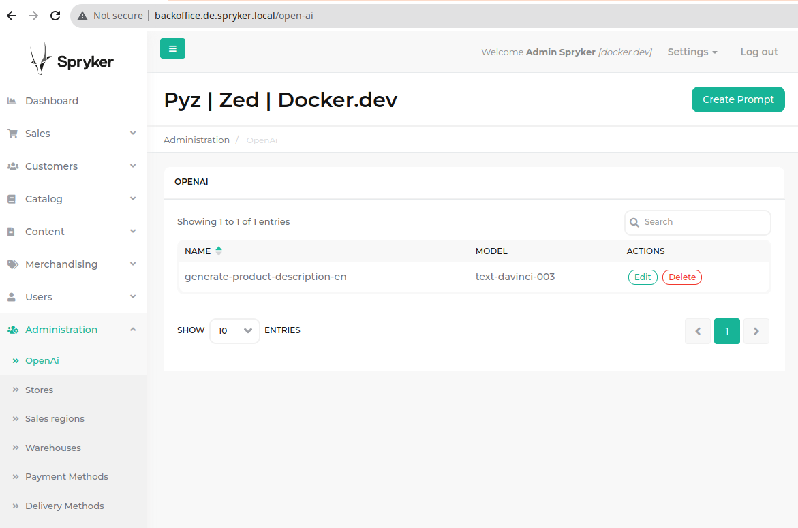
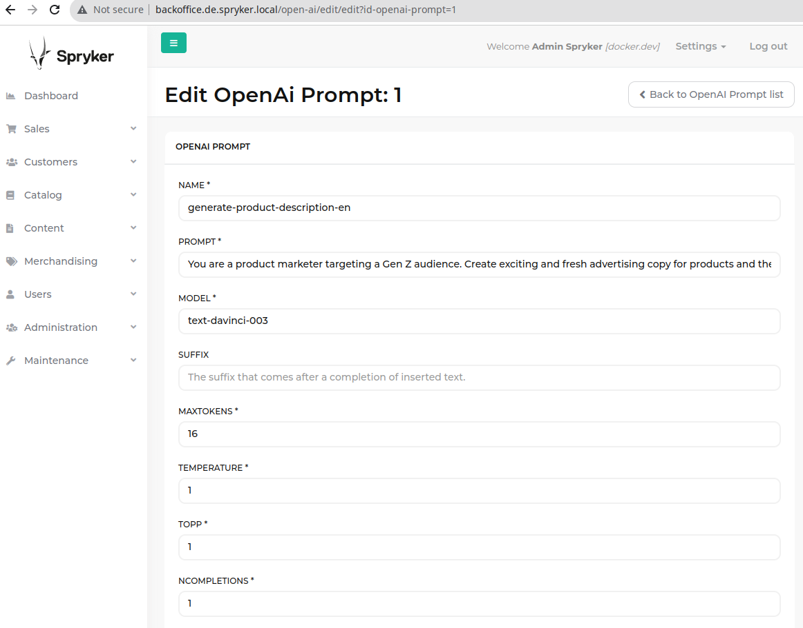
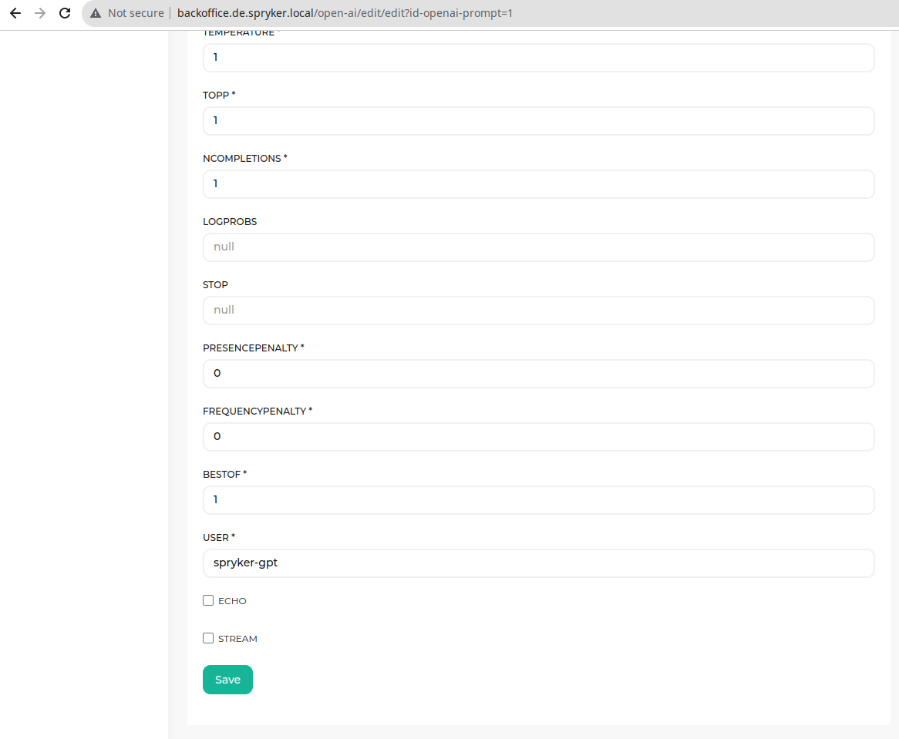
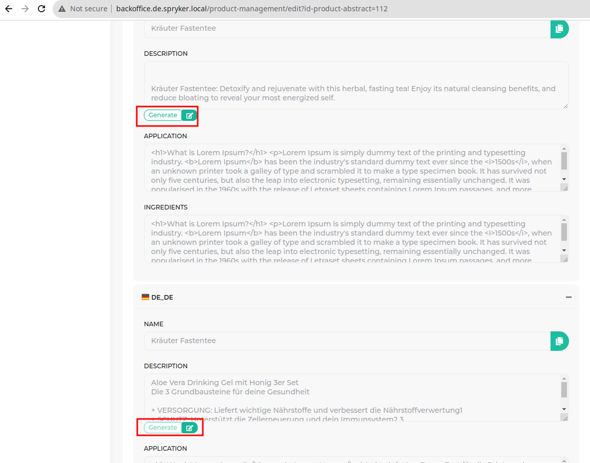
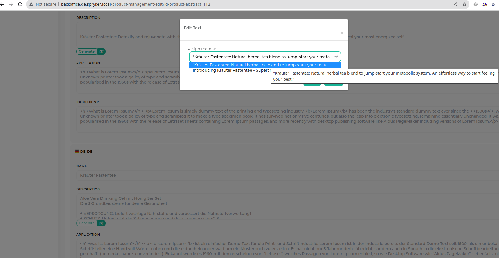
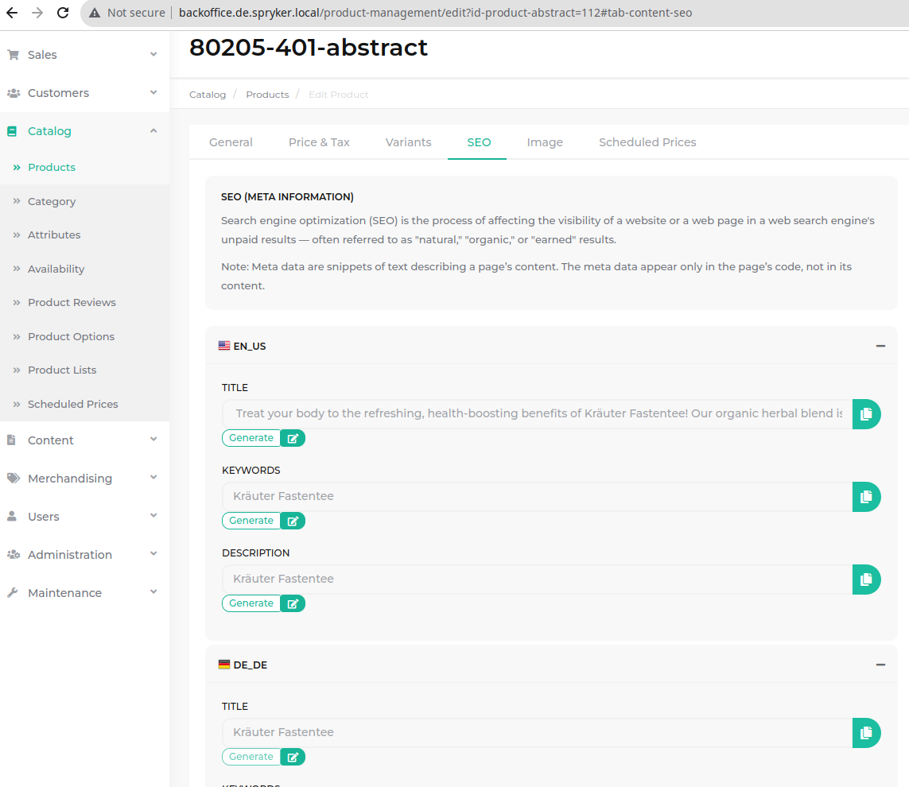
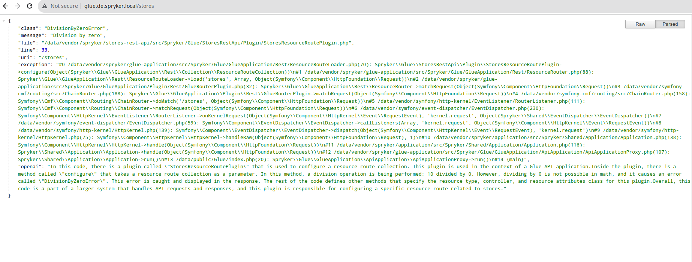

# Open AI Spryker package


# Description
- OpenAI Client for spryker
- BO UI to manage prompts
- BO UI to generate prompts for:
    - product descriptions
    - seo title
    - seo keywords
    - seo description
- New OpenAi ErrorRenderer
  - OpenAi5YearsApiDebugErrorRenderer
  - OpenAiApiDebugErrorRenderer

# Screenshots








# Example usage
- use this snipped to upgrade backoffice inputs to openai inputs (also see `Zed/OpenAi/assets/Zed/js/modules/openai.js:4`)
 ```javascript
 attachOpenAiCompletionApiToToForm('textarea[name*="description"]', function(event, languageContext) {
  let nameInput = $('input[name*="'+languageContext+'][name"]');
  let skuInput = $('input[name*="'+languageContext+'][sku"]');
  return {title: nameInput.value, sku: skuInput.value};
 });
 ```

# HowTos Cli
 - docker/sdk up
